# My Digital Garden

Can't stop re-creating my personal website 🙃

## TODOs

- [] add more to readme
- [] add github links for project cards
- [] add technology tags to project cards (maybe)

## Infrastructure

Most of the hosting solutions out there now charge roughly $5/month to host your apps. On the free tiers, there's a cold start. I decided to self-host my apps using a Raspberry Pi, Dokku and Cloudflare Tunnels.

### High Level Overview

I'm running a **multi-tenant PaaS setup** using:

1. **Dokku** (Docker-based PaaS) on Raspberry Pi hosting two applications
2. **Single Cloudflare Tunnel** routing traffic to both apps based on hostname
3. **NGINX** (managed by Dokku) handling virtual hosting and SSL termination
4. **DNS managed by Cloudflare** with nameservers pointing from domain registrars

#### Traffic Flow

### Architectural Components

- User visits `sonicsight.dev` → Cloudflare → Tunnel → NGINX → sonicsight app
- User visits `khoahuynh.ca` → Cloudflare → Tunnel → NGINX → digital-garden app

#### **1. DNS & Domain Management**

- **Nameservers**: Point to Cloudflare if the domain isn't already on Cloudflare
- **DNS Records**: Managed in Cloudflare (CNAME to tunnel)
- **Domains**: `sonicsight.dev` (Cloudflare) + `khoahuynh.ca` (Porkbun)

#### **2. Cloudflare Layer**

- **Single tunnel** handles both domains
- **Proxy + CDN** for performance and security
- **SSL termination** at Cloudflare edge

#### **3. Raspberry Pi Infrastructure**

- **Dokku**: Container orchestration and deployment
- **NGINX**: Virtual host routing based on `Host` header
- **Docker containers**: Isolated app environments

#### **4. Application Isolation**

- **Port segregation**: sonicsight (3000) vs digital-garden (3001)
- **Independent deployments**: `git push dokku main` for each app (heroku-like deploys)
- **Separate configs**: Each app has its own nginx.conf (handled by Dokku)

### Lil diagram

```mermaid
flowchart TB
    subgraph "Internet Users"
        User1["sonicsight.dev visitor"]
        User2["khoahuynh.ca visitor"]
    end

    subgraph "Cloudflare"
        DNS["Cloudflare DNS"]
        Tunnel["Cloudflare Tunnel"]
        Proxy["Cloudflare Proxy"]
    end

    subgraph "Domain Registrars"
        Porkbun["Porkbun<br/>(khoahuynh.ca)"]
        CloudflareReg["Cloudflare Registrar<br/>(sonicsight.dev)"]
    end

    subgraph "Raspberry Pi"
        subgraph "Dokku PaaS"
            NGINX["NGINX<br/>(Virtual Host Router)"]

            subgraph "sonicsight app"
                SonicContainer["Docker Container<br/>FastHTML App<br/>Port 3000"]
            end

            subgraph "digital-garden app"
                GardenContainer["Docker Container<br/>Go Web Server<br/>Port 3001"]
            end
        end

        CloudflaredDaemon["cloudflared daemon<br/>(tunnel client)"]
    end

    subgraph "External Services"
        subgraph "Hugging Face"
            GradioAPI["Gradio API"]
            AIModel["AI Model"]
        end

        subgraph "Kaggle"
            Training["Model Training"]
        end
    end

    %% DNS Resolution
    Porkbun -.->|"NS Records"| DNS
    CloudflareReg -.->|"Auto-configured"| DNS

    %% User Requests
    User1 -->|"https://sonicsight.dev"| Proxy
    User2 -->|"https://khoahuynh.ca"| Proxy

    %% Cloudflare Processing
    Proxy --> DNS
    DNS --> Tunnel
    Tunnel -->|"Secure Connection<br/>Port 80"| CloudflaredDaemon

    %% Internal Routing
    CloudflaredDaemon --> NGINX
    NGINX -->|"Host: sonicsight.dev<br/>→ localhost:3000"| SonicContainer
    NGINX -->|"Host: khoahuynh.ca<br/>→ localhost:3001"| GardenContainer

    %% App Dependencies
    SonicContainer -->|"API Calls"| GradioAPI
    GradioAPI --> AIModel
    Training -.->|"Model Export"| AIModel

    %% Configuration Files
    subgraph "Routing Configuration"
        PortRouting["NGINX Virtual Host Routing<br/>• sonicsight.dev → Port 3000<br/>• khoahuynh.ca → Port 3001<br/>• Based on HTTP Host header"]
        TunnelRouting["Cloudflare Tunnel Config<br/>• All domains → localhost:80<br/>• NGINX handles hostname routing"]
    end

    CloudflaredDaemon -.-> TunnelRouting
    NGINX -.-> PortRouting

    %% Styling
    classDef user fill:#e1f5fe,stroke:#01579b,stroke-width:2px
    classDef cloudflare fill:#f3e5f5,stroke:#4a148c,stroke-width:2px
    classDef registrar fill:#fff3e0,stroke:#e65100,stroke-width:2px
    classDef raspberry fill:#e8f5e8,stroke:#2e7d32,stroke-width:2px
    classDef container fill:#fff8e1,stroke:#f57f17,stroke-width:2px
    classDef external fill:#fce4ec,stroke:#880e4f,stroke-width:2px
    classDef config fill:#f1f8e9,stroke:#33691e,stroke-width:1px,stroke-dasharray: 5 5

    class User1,User2 user
    class DNS,Tunnel,Proxy,CloudflareReg cloudflare
    class Porkbun registrar
    class NGINX,CloudflaredDaemon raspberry
    class SonicContainer,GardenContainer container
    class GradioAPI,AIModel,Training external
    class TunnelConfig,NginxSonic,NginxGarden config
```

